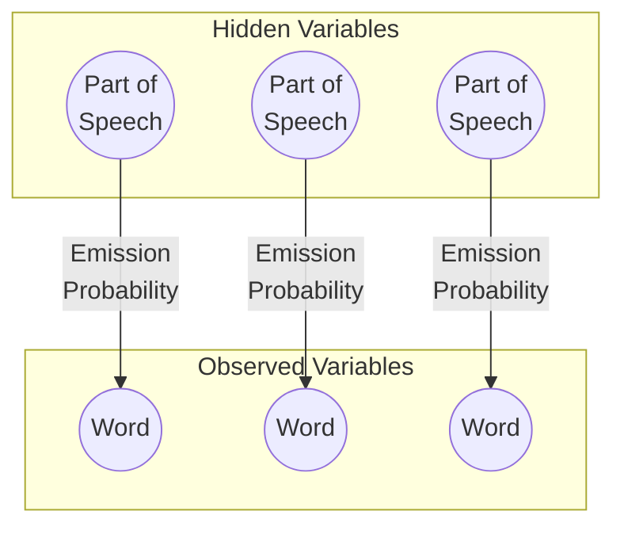
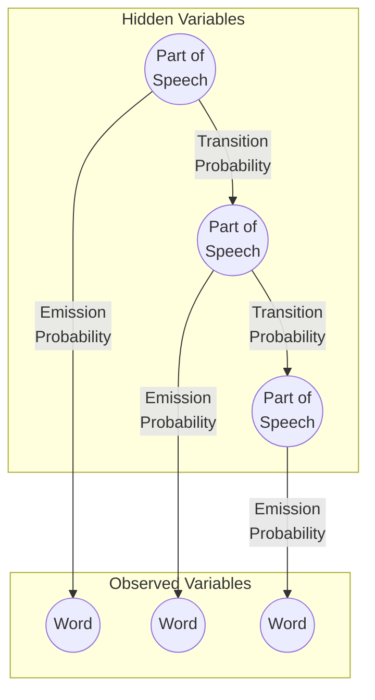
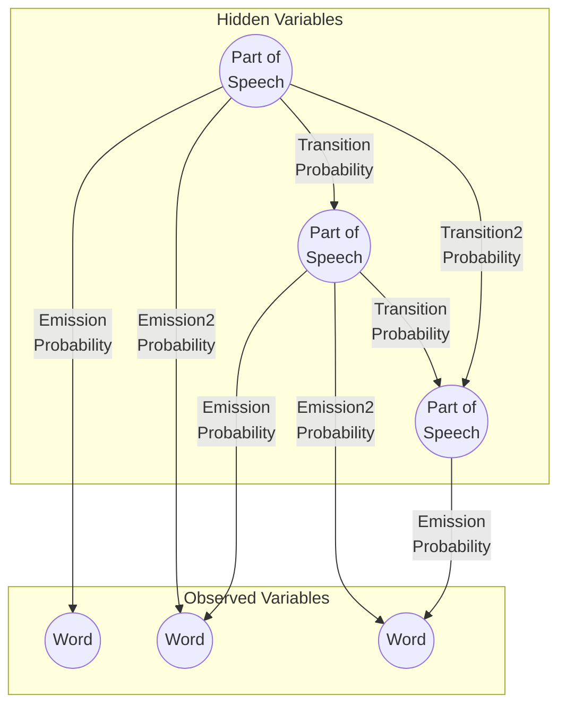

# Part 1

## Problem Formulation

This problem is formulated in the following way:

- **Algorithm**: Bayesian Networks via Simple model, Hidden Markov Model, and Monte Carlo Markov Chain
- **Goal State**: List of correct parts-of-speech for a sentence
- **Observed Variables $O$**: Words in a sentence
- **Hidden Variables $Q$**: parts-of-speech corresponding to the words in the sentence

## Solution Overview

Given sentence, the goal of this exercise is to predict the part-of-speech corresponding to each word. This is accomplished by using a variety of *Bayesian Networks* to predict the part-of-speech to which each word belongs. This is accomplished by first "training" the algorithm on a corpus of words and sentences which have been labeled with correct parts-of-speech. From this corpus are computed the probabilities of parts-of-speech that start sentences (initial probabilities), the probabilities of a part-of-speech occurring after another part-of-speech (transition probabilities), and parts-of-speech corresponding to particular words (emission probabilities). These probabilities are used to compute the *posterior probability* for parts-of-speech at a given position in the sentence whereby the part-of-speech with the highest posterior probability is the prediction. 

The following sections outline this implementation in more detail.

### Model Training

The training phase includes calculating all the probabilities for the model predictions. The 3 main probabilities are:

1. **Initial Probabilities**: How often each part of speech tag occurs at the beginning of the sentence.
2. **Transition Probabilities**: This is the frequency of a part of speech following another part of speech.
3. **Emission Probabilities**: The frequency of each word being associated with another part of speech tag. 

In the training portion of the program, we process an already tagged file of POS. The initial probabilities, transition probabilities, and emission probabilities are counted and analyzed within their respective segments. We implemented LaPlace smoothing to handle any unseen words or transitions that are not in the training data.

### Simple Model

The simple model uses the emission probabilities that are calculated during the training phase. The simple model does not include much of the context where a word might show up in a POS. We simply select the highest probability tag that is associated with that word. This makes it a quick calculation but far less accurate than the other models. The simple model, while not very effective, worked as a steppingstone in implementing the HMM. At first, we were not very accurate in predicting tags, however after implementing LaPlace smoothing, we began to the model to be much more accurate in its predictions.

*Example of Bayesian Network for Simple Model:*

### Hidden Markov Model by Viterbi Algorithm

The Hidden Markov Model uses both emission probabilities and transition probabilities to calculate and determine the best tags for each sentence. The program implements the Viterbi algorithm to find the highest likelihood of sequences of tags given the hidden states. Here are the steps we follow when implementing: 

- **Initialize**: We first calculate the probabilities for the tags of the first word. 
- **Iteration**: We then iterate through the rest of the sentence, using log probabilities so that our values do not become too small.
- **Termination and Backtracking**: Once we process all the words the Viterbi algorithm backtracks determining the sequence of tags that have the highest probability. 

The HMM with Viterbi Algorithm is much more effective than the simple model as it uses more context of the tags within the sentence to predict each tag. Even though the HMM model seems to work just fine computationally, implementing a different data structure could help optimize the model.

*Example of Bayesian Network for Hidden Markov Model:*

### Complex Model by Markov Chain Monte Carlo Sampling

The *Complex Model* is a Bayesian Network composed by a directed acyclic graph composed of nodes as either hidden variables (part-of-speech) or observed variales (words). The nodes are ordered pairwise, with a hidden and observed variable constituting a pair at a given level of the graph. The nodes connected by one of 4 different edge types:

1. Emission Probabilities connect the hidden node to the observed node at a given level.
2. Emission2 probabilities connect the hidden node to the observed node at the next level.
3. Transition probabilities connect the hidden node to the hidden node at the next level. 
4. Transition2 probabilities connect the hidden node to the hidden node two levels ahead. 

*Example of Bayesian Network for Complex Model:*

For a given sentence, this algorithm iterates through each word. It begins by subsetting the relevant dictionaries of edge probabilities for initial, emission, emission2, transition, and transition2 probabilities the given word. This gathers all of the possible probabilities for the part-of-speech for the given word, and its context given the observed words and previous parts-of-speech. Because of the complexity of this graph structure, the approach taken is *Markov Chain Monte Carlo* simulations. Parts-of-speech are drawn for the word by *Gibbs Sampling* - randomly drawing a part-of-speech for the hidden variable from the distribution of probabilities given by the latent variables related by the edge probabilities. For example, the most probable walk along the markov chain is drawn by the following process:

1. The probability distribution for the first part-of-speech is created from the combinations of the initial part-of-speech probability for the word, the emission probability, and emission2 probability (given by the first and second observed words, respectively). A number of random samples are drawn from this probability distribution, and the part-of-speech which occurs most is recorded as the first tag in the sentence. 
2. The probability distribution for the second part-of-speech is created from the combinations of probabilities given by the transition probability from the first part-of-speech tag, along with the emission and emission2 probabilities of the second and third observed words. Again, a number of random samples are drawn from this probability distribution, and the part-of-speech which occurs most is recorded as the second tag in the sentence. 
3. The probability distribution for the third part-of-speech is created from the combinations of probabilities given by the transition2 probability from the first part-of-speech, the transition probability from the second part-of-speech, and the emission and emission2 probabilities of the third and fourth observed words. Yet again, a number of random samples are drawn from this probability distribution, and the part-of-speech which occurs most is recorded as the third tag in the sentence. 
4. Step 3 is repeated for each remaining position in the sentence until parts-of-speech are drawn for each word. 

In this way, the most probable walk is simulated. After drawing several (100s to 1000s) of samples for each word, the part-of-speech pattern which is drawn represents the most likely assignment of parts-of-speech for the given sentence. 

## Discussion

In our program the training phase calculates the initial probabilities, transition probabilities, and emission probabilities effectively using the training data. The Laplace smoothing helps give a small probability to any word tag pair or transition between tags that was not in the training data. The simple model is very fast, but very ineffective in predicting sequence of POS tags. There is no context for the position of each tag and what surrounds it, or where it might show up. This all leads to very low accuracy. The HMM using the Viterbi algorithm is a very big improvement over the simple model. There is a lot more context in what the model uses to predict the POS tags by using the emission probabilities and transition probabilities. The result for the HMM is that it is much better at predicting the POS tags than the simple model, while not as good as the complex model. Although, it takes a lot less computational time than the complex model.

The complex model can be tuned by the setting the number of Gibbs sampling iterations - increasing the number of samples which are drawn for each word also increases the accuracy since, by the Law of Large Numbers, these samples will approach the actual distribution of the markov chain. This method performs well against the hidden markov model and generally is about as accurate (if not, moreso), even with relatively low number of simulations (only 100 by default) per word. However, the method *is* significantly slower than the Viterbi algorithm. The underlying bayesian network has almost twice as many edges so is significantly more complicated, so some performance loss is expected. That said, this particular implementation could be improved by using a more optimal data structure. Instead of using dictionaries with tuples of strings as keys to store the log probabilities, it would be faster to use vectorized tabular operations instead. 

### Work Allocation

Throughout this assignment we met to look at how implementation should happen and how the workload should be allocated. We stayed in good communication with each other about what steps we had taken, what we had implemented and the next steps we were planning on taking. Jon did the programming of the initial program setup and model training for the simple model and HMM, and Mark did the implementation of the complex model and went back through the program and did some fine tuning. In general, the report was split between the two respective areas and the person implemented a specific area also wrote the report about that area, while Mark designed all the graphs in the report. Overall, we felt like we evenly split the workload and implementation of the program and communicated well together. 

### Summary of Work Performed

The git history shows a good summary of changes and work performed, as this repository was freshly initialized from the contents of `cs-b551-fa2023/assignment-a5`. If reviewing git history, note that work in commit `4dc6f97` belongs to Jonathan - not Mark - and is associated with commits `50192ab` and `c998342` on the `pos_solver_branch`. 

**Jonathan**

- Code writing of `pos_solver.py` including `train`, `posterior`, `simplified`, and `hmm_viterbi` methods
- Report writing for sections: model training, simple model overview, hmm model overview, simple + hmm discussion, work allocation

**Mark**

- Code writing of `pos_solver.py` including `SampleKeys`, `mcmc_word_probs`, and `complex_mcmc` methods
- Code review and cleanup, `SILO` testing, and inline documentation of all `pos_solver.py` methods
- Report writing for sections: problem formulation, solution overview intro, complex model overview, complex model discussion, and work summary
- Git admin, markdown formatting + `mermaid` plots

